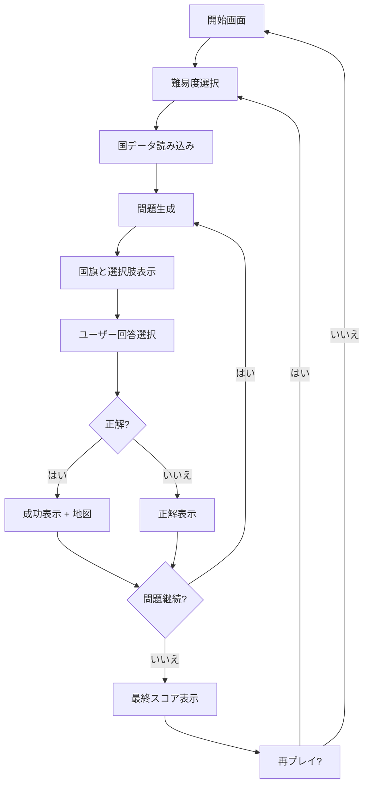
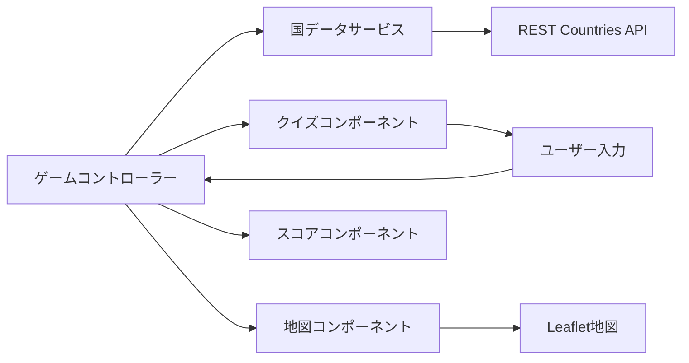

# Design Document

## Overview

国旗あてゲームは、日本の子ども（幼児～小学生）を対象とした教育的価値を持つインタラクティブなWebアプリケーションです。ユーザーは国旗を見て国名を当て、正解時には世界地図でその国の位置を確認できます。年齢に応じた日本語表示（ひらがな・カタカナ・漢字）により、子どもの読み書きレベルに合わせた学習体験を提供します。

## Architecture

### システム構成
- **フロントエンド**: Vanilla JavaScript + HTML5 + CSS3
- **データソース**: REST Countries API (https://restcountries.com/)
- **地図ライブラリ**: Leaflet.js（CDN経由）
- **ホスティング**: 静的サイトホスティング対応（GitHub Pages等）

### アーキテクチャパターン
- **シンプルなモジュール構造**: 機能別にJSファイルを分割
- **Event-driven**: DOM イベントによるユーザーインタラクション
- **関数型アプローチ**: クラスよりもシンプルな関数を中心とした設計

## Components and Interfaces

### Core Components

#### 1. app.js (アプリケーション初期化)
```javascript
// アプリケーション全体の初期化とイベント管理
function initializeApp() { /* ... */ }
function setupEventListeners() { /* ... */ }
function handleDifficultySelection(difficulty) { /* ... */ }
function showStartScreen() { /* ... */ }
```

#### 2. game.js (メインゲームロジック)
```javascript
const gameState = {
  currentQuestion: 0,
  score: 0,
  totalQuestions: 10,
  difficulty: 'beginner',
  isGameActive: false,
  usedCountries: [] // 重複防止のための出題済み国リスト
};

function startGame(difficulty) { /* ... */ }
function nextQuestion() { /* ... */ }
function checkAnswer(selectedCountry) { /* ... */ }
function getRandomUnusedCountry(countries, usedCountries) { /* ... */ }
```

#### 3. countryService.js (データ取得)
```javascript
async function fetchCountries() { /* ... */ }
function getRandomCountry(countries, difficulty) { /* ... */ }
function generateWrongAnswers(correctCountry, allCountries, count, usedCountries) { /* ... */ }
function getCountriesByDifficulty(countries, difficulty) { /* ... */ }
```

#### 4. ui.js (UI操作)
```javascript
function displayFlag(flagUrl, countryName) { /* ... */ }
function showOptions(countries) { /* ... */ }
function updateScore(score, total) { /* ... */ }
function showResult(isCorrect, correctAnswer) { /* ... */ }
```

#### 5. map.js (地図機能)
```javascript
let map = null;

function initializeMap() { /* ... */ }
function highlightCountry(countryCode, coordinates) { /* ... */ }
function showCountryInfo(country) { /* ... */ }
```

### データモデル

#### 国データモデル（日本語対応拡張版）
```javascript
{
  name: {
    common: "Japan",
    official: "Japan",
    japanese: "日本",
    hiragana: "にほん"
  },
  cca2: "JP",
  cca3: "JPN",
  flag: "🇯🇵",
  flags: {
    png: "https://flagcdn.com/w320/jp.png",
    svg: "https://flagcdn.com/jp.svg"
  },
  capital: {
    english: ["Tokyo"],
    japanese: ["東京"],
    hiragana: ["とうきょう"]
  },
  region: {
    english: "Asia",
    japanese: "アジア",
    hiragana: "あじあ"
  },
  subregion: {
    english: "Eastern Asia",
    japanese: "東アジア",
    hiragana: "ひがしあじあ"
  },
  latlng: [36.0, 138.0],
  area: 377930,
  population: 125836021
}
```

#### ゲーム状態モデル
```javascript
{
  currentQuestion: 0,
  totalQuestions: 10,
  score: 0,
  difficulty: "beginner",
  languageMode: "japanese", // 言語表示モード（hiragana/japanese/english）
  countries: [],
  currentCountry: null,
  options: [],
  isGameActive: false,
  usedCountries: [] // 出題済み国のコードリスト（重複防止）
}
```

## Architecture

### アプリケーションフロー


### コンポーネント相互作用


## Components and Interfaces

### UI Layout Structure
```
┌─────────────────────────────────────┐
│ Header (Title + Score)              │
├─────────────────────────────────────┤
│ Main Game Area                      │
│ ┌─────────────┐ ┌─────────────────┐ │
│ │ Flag Image  │ │ World Map       │ │
│ │             │ │ (Hidden/Shown)  │ │
│ └─────────────┘ └─────────────────┘ │
│ ┌─────────────────────────────────┐ │
│ │ Answer Options (4 buttons)      │ │
│ └─────────────────────────────────┘ │
├─────────────────────────────────────┤
│ Footer (Progress + Controls)        │
└─────────────────────────────────────┘
```

### Difficulty Configuration
```javascript
const DIFFICULTY_CONFIG = {
  beginner: {
    countries: 25,
    regions: ['Europe', 'North America'],
    questionsCount: 10
  },
  intermediate: {
    countries: 60,
    regions: ['Europe', 'Asia', 'North America', 'South America'],
    questionsCount: 15
  },
  advanced: {
    countries: 150,
    regions: 'all',
    questionsCount: 20
  }
};
```

## Data Models

### API統合
- **プライマリ**: REST Countries API v3.1
- **バックアップ**: オフライン機能用のローカルJSONフォールバック
- **国旗画像**: 高品質国旗画像のためのFlagcdn.com
- **地図データ**: Leaflet.js経由のOpenStreetMap

### キャッシュ戦略
- 国データをlocalStorageにキャッシュ
- 選択された難易度の国旗画像をプリロード
- Leafletによるマップタイルキャッシュ

### フォールバックデータ管理システム

#### データ階層構造
```
1. プライマリ: REST Countries API (リアルタイム)
2. セカンダリ: LocalStorage キャッシュ (24時間有効)
3. ターシャリ: 静的JSONファイル (data/countries.json)
4. 最終: 最小限埋め込みデータ (緊急時のみ)
```

#### ファイル構造
```
data/
├── countries.json              # 静的フォールバックデータ（手動生成）
└── scripts/
    └── generate-countries.js   # 一度きりのデータ生成スクリプト
```

#### データ生成戦略
```javascript
// 開発時一度きりのデータ生成
class CountryDataGenerator {
  async generateStaticData() {
    // 1. REST Countries APIから全データ取得
    // 2. 難易度別に国を分類・選択
    // 3. 必要なフィールドのみ抽出
    // 4. 静的JSONファイルとして保存
    // 5. 開発者が必要と判断した時のみ再実行
  }
}
```

#### フォールバック読み込みロジック
```javascript
async function loadFallbackData() {
  try {
    // 静的JSONファイルを読み込み（常に存在する前提）
    const response = await fetch('./data/countries.json');
    if (response.ok) {
      return await response.json();
    }
    throw new Error('Failed to load countries.json');
  } catch (error) {
    console.error('Critical error: countries.json not available', error);
    // 開発環境でのみ最小限埋め込みデータを使用
    return getMinimalEmbeddedData();
  }
}
```

### 日本語対応システム

#### 設計原則
- 日本の子ども（幼児～小学生）の読み書きレベルに対応
- 3つの言語表示モード：ひらがな、日本語（カタカナ・漢字）、英語
- ゲーム全体で一貫した言語表示
- 地図上の情報も含めた包括的な日本語化

#### 言語モード設定
```javascript
const LANGUAGE_MODES = {
  hiragana: {
    name: "ひらがな",
    description: "ようじむけ（すべてひらがな）",
    targetAge: "3-6歳"
  },
  japanese: {
    name: "日本語",
    description: "小学生向け（カタカナ・漢字含む）",
    targetAge: "6-12歳"
  },
  english: {
    name: "English",
    description: "中学生以上向け（英語表示）",
    targetAge: "12歳以上"
  }
};
```

#### 表示名取得ロジック
```javascript
// 国名取得関数
function getCountryName(country, languageMode) {
  switch (languageMode) {
    case 'hiragana':
      return country.name.hiragana || country.name.japanese || country.name.common;
    case 'japanese':
      return country.name.japanese || country.name.common;
    case 'english':
    default:
      return country.name.common;
  }
}

// 首都名取得関数
function getCapitalName(country, languageMode) {
  if (!country.capital) return '不明';
  
  switch (languageMode) {
    case 'hiragana':
      return country.capital.hiragana?.[0] || country.capital.japanese?.[0] || country.capital.english?.[0];
    case 'japanese':
      return country.capital.japanese?.[0] || country.capital.english?.[0];
    case 'english':
    default:
      return country.capital.english?.[0] || country.capital[0];
  }
}

// 地域名取得関数
function getRegionName(country, languageMode) {
  if (!country.region) return '不明';
  
  switch (languageMode) {
    case 'hiragana':
      return country.region.hiragana || country.region.japanese || country.region.english;
    case 'japanese':
      return country.region.japanese || country.region.english;
    case 'english':
    default:
      return country.region.english || country.region;
  }
}
```

#### UI統合
```javascript
// 選択肢表示の更新
function showOptions(countries, languageMode) {
  const countryNames = countries.map(country => getCountryName(country, languageMode));
  // UI更新処理
}

// 地図ポップアップの更新
function createCountryInfoPopup(country, languageMode) {
  const countryName = getCountryName(country, languageMode);
  const capitalName = getCapitalName(country, languageMode);
  const regionName = getRegionName(country, languageMode);
  
  return `
    <div class="country-popup">
      <h3>${countryName}</h3>
      <p>首都: ${capitalName}</p>
      <p>地域: ${regionName}</p>
    </div>
  `;
}
```

#### データ生成拡張
```javascript
// データ生成スクリプトの拡張
const JAPANESE_TRANSLATIONS = {
  countries: {
    "United States": { japanese: "アメリカ合衆国", hiragana: "あめりかがっしゅうこく" },
    "Japan": { japanese: "日本", hiragana: "にほん" },
    "Germany": { japanese: "ドイツ", hiragana: "どいつ" }
    // ... 他の国の翻訳
  },
  capitals: {
    "Washington, D.C.": { japanese: "ワシントンD.C.", hiragana: "わしんとんでぃーしー" },
    "Tokyo": { japanese: "東京", hiragana: "とうきょう" },
    "Berlin": { japanese: "ベルリン", hiragana: "べるりん" }
    // ... 他の首都の翻訳
  },
  regions: {
    "Americas": { japanese: "アメリカ大陸", hiragana: "あめりかたいりく" },
    "Asia": { japanese: "アジア", hiragana: "あじあ" },
    "Europe": { japanese: "ヨーロッパ", hiragana: "よーろっぱ" }
    // ... 他の地域の翻訳
  }
};
```

### 重複防止システム

#### 設計原則
- 同一ゲームセッション内で同じ国旗が重複して出題されることを防ぐ
- 選択肢でも可能な限り出題済みの国を避ける
- 全ての国が出題済みになった場合は、リストをリセットして継続

#### 実装詳細
```javascript
// 重複防止のデータ構造
const gameState = {
  usedCountries: [], // 出題済み国のcca2コードを格納
  // ... その他のゲーム状態
};

// 未使用国の選択アルゴリズム
function getRandomUnusedCountry(countries, usedCountries) {
  // 1. 未使用の国をフィルタリング
  const availableCountries = countries.filter(country => 
    !usedCountries.includes(country.cca2)
  );
  
  // 2. 未使用国がない場合はリセット
  if (availableCountries.length === 0) {
    gameState.usedCountries = [];
    return getRandomCountry(countries);
  }
  
  // 3. ランダム選択
  return availableCountries[Math.floor(Math.random() * availableCountries.length)];
}

// 選択肢生成での重複回避
function generateWrongAnswers(correctCountry, allCountries, count, usedCountries) {
  // 正解国と出題済み国を除外してから選択肢を生成
  const availableCountries = allCountries.filter(country => 
    country.cca2 !== correctCountry.cca2 && 
    !usedCountries.includes(country.cca2)
  );
  
  // 十分な選択肢がない場合は出題済み制限を緩和
  const countriesToUse = availableCountries.length >= count 
    ? availableCountries 
    : allCountries.filter(country => country.cca2 !== correctCountry.cca2);
    
  return shuffleAndSelect(countriesToUse, count);
}
```

#### 状態管理
```javascript
// ゲーム開始時
function startGame(difficulty) {
  gameState.usedCountries = []; // リセット
  // ... ゲーム初期化
}

// 問題生成時
function nextQuestion() {
  // 1. 未使用国を選択
  const country = getRandomUnusedCountry(gameState.countries, gameState.usedCountries);
  
  // 2. 使用済みリストに追加
  gameState.usedCountries.push(country.cca2);
  
  // 3. 選択肢生成（重複回避）
  const wrongAnswers = generateWrongAnswers(
    country, 
    gameState.countries, 
    3, 
    gameState.usedCountries
  );
}
```

## エラーハンドリング

### API障害
```javascript
class ErrorHandler {
  handleAPIError(error) {
    // Fallback to local data
    // Show user-friendly message
    // Log error for debugging
  }
  
  handleNetworkError() {
    // Enable offline mode
    // Use cached data
  }
  
  handleImageLoadError(flagUrl) {
    // Show placeholder flag
    // Retry with alternative source
  }
}
```

### ユーザーエクスペリエンス
- 低速接続時の優雅な劣化
- 全非同期操作のローディング状態
- 日本語での明確なエラーメッセージ
- 失敗した操作のリトライメカニズム

## Testing Strategy

### Test File Organization

#### 現状分析
現在、テストファイルがプロジェクトルートに散らばっており、以下の問題があります：
- 12個のテストファイルがルートディレクトリに配置
- 機能別の分類がない
- テストランナーの設定が複雑
- 新しいテストファイルの追加時の混乱

#### 提案するテスト構造
```
tests/
├── README.md                    # テスト実行ガイド
├── integration/                 # 統合テスト
│   ├── core/
│   │   ├── game-functionality.html
│   │   ├── quiz-core.html
│   │   └── score-management.html
│   ├── ui/
│   │   ├── difficulty-selection.html
│   │   ├── ui-feedback.html
│   │   └── final-integration.html
│   ├── services/
│   │   └── country-service.html
│   └── map/
│       ├── map-functionality.html
│       ├── map-integration.html
│       └── interactive-map.html
├── utils/
│   ├── test-runner.js           # 統合テストランナー
│   └── test-helpers.js          # 共通テストユーティリティ
└── reports/
    ├── integration-summary.md   # テスト結果サマリー
    └── coverage/                # カバレッジレポート
```

#### テストファイル移行マッピング
```javascript
// 現在のファイル → 新しい場所
const migrationMap = {
  'test_game_functionality.html': 'tests/integration/core/game-functionality.html',
  'test_quiz_core.html': 'tests/integration/core/quiz-core.html',
  'test_score_management.html': 'tests/integration/core/score-management.html',
  'test_difficulty_selection.html': 'tests/integration/ui/difficulty-selection.html',
  'test_ui_feedback.html': 'tests/integration/ui/ui-feedback.html',
  'test_final_integration.html': 'tests/integration/ui/final-integration.html',
  'test_country_service.html': 'tests/integration/services/country-service.html',
  'test_map_functionality.html': 'tests/integration/map/map-functionality.html',
  'test_map_integration.html': 'tests/integration/map/map-integration.html',
  'test_interactive_map.html': 'tests/integration/map/interactive-map.html',
  'test_error_handling.html': 'tests/integration/core/error-handling.html',
  'run_integration_tests.js': 'tests/utils/test-runner.js',
  'test_score_functionality.js': 'tests/utils/test-helpers.js'
};
```

#### テストランナーの更新
```javascript
// 新しいテストランナー設定
const testConfig = {
  testDirectory: './tests/integration',
  categories: ['core', 'ui', 'services', 'map'],
  outputDirectory: './tests/reports',
  parallel: true,
  timeout: 30000
};
```

### 単体テスト
- ゲームコントローラーロジックのテスト
- 国データサービスAPI統合のテスト
- スコア計算精度のテスト
- 難易度フィルタリングロジックのテスト

### 統合テスト
- コンポーネント間相互作用のテスト
- APIレスポンス処理のテスト
- 地図統合機能のテスト
- ローカルストレージ操作のテスト

### ユーザー受け入れテスト
- クロスブラウザ互換性（Chrome、Firefox、Safari、Edge）
- モバイルレスポンシブテスト
- タッチ操作検証
- 大規模データセットでのパフォーマンステスト

### テストシナリオ
1. **正常パス**: 開始から終了までの完全なゲームフロー
2. **エラーシナリオ**: ネットワーク障害、無効データ、画像読み込み失敗
3. **エッジケース**: 高速クリック、ゲーム中のブラウザリフレッシュ
4. **アクセシビリティ**: キーボードナビゲーション、スクリーンリーダー対応
5. **パフォーマンス**: 大規模国データセット、複数同時ゲーム