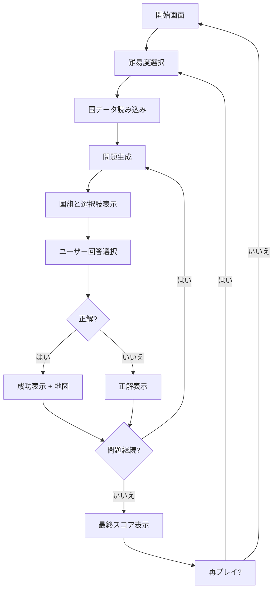
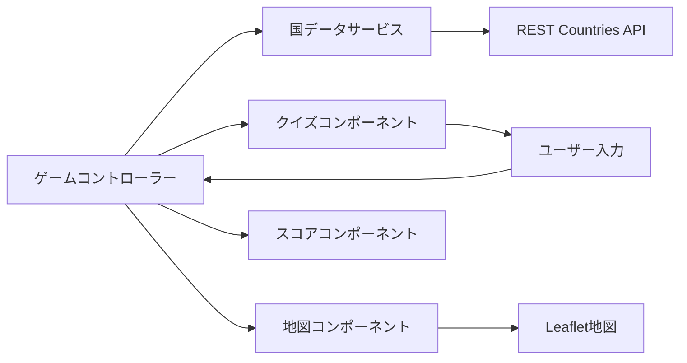

# Design Document

## Overview

国旗あてゲームは、教育的価値を持つインタラクティブなWebアプリケーションです。ユーザーは国旗を見て国名を当て、正解時には世界地図でその国の位置を確認できます。シンプルで直感的なUIと、段階的な学習体験を提供します。

## Architecture

### システム構成
- **フロントエンド**: Vanilla JavaScript + HTML5 + CSS3
- **データソース**: REST Countries API (https://restcountries.com/)
- **地図ライブラリ**: Leaflet.js（CDN経由）
- **ホスティング**: 静的サイトホスティング対応（GitHub Pages等）

### アーキテクチャパターン
- **シンプルなモジュール構造**: 機能別にJSファイルを分割
- **Event-driven**: DOM イベントによるユーザーインタラクション
- **関数型アプローチ**: クラスよりもシンプルな関数を中心とした設計

## Components and Interfaces

### Core Components

#### 1. app.js (アプリケーション初期化)
```javascript
// アプリケーション全体の初期化とイベント管理
function initializeApp() { /* ... */ }
function setupEventListeners() { /* ... */ }
function handleDifficultySelection(difficulty) { /* ... */ }
function showStartScreen() { /* ... */ }
```

#### 2. game.js (メインゲームロジック)
```javascript
const gameState = {
  currentQuestion: 0,
  score: 0,
  totalQuestions: 10,
  difficulty: 'beginner',
  isGameActive: false
};

function startGame(difficulty) { /* ... */ }
function nextQuestion() { /* ... */ }
function checkAnswer(selectedCountry) { /* ... */ }
```

#### 3. countryService.js (データ取得)
```javascript
async function fetchCountries() { /* ... */ }
function getRandomCountry(countries, difficulty) { /* ... */ }
function generateWrongAnswers(correctCountry, allCountries) { /* ... */ }
```

#### 4. ui.js (UI操作)
```javascript
function displayFlag(flagUrl, countryName) { /* ... */ }
function showOptions(countries) { /* ... */ }
function updateScore(score, total) { /* ... */ }
function showResult(isCorrect, correctAnswer) { /* ... */ }
```

#### 5. map.js (地図機能)
```javascript
let map = null;

function initializeMap() { /* ... */ }
function highlightCountry(countryCode, coordinates) { /* ... */ }
function showCountryInfo(country) { /* ... */ }
```

### データモデル

#### 国データモデル
```javascript
{
  name: {
    common: "Japan",
    official: "Japan"
  },
  cca2: "JP",
  cca3: "JPN",
  flag: "🇯🇵",
  flags: {
    png: "https://flagcdn.com/w320/jp.png",
    svg: "https://flagcdn.com/jp.svg"
  },
  capital: ["Tokyo"],
  region: "Asia",
  subregion: "Eastern Asia",
  latlng: [36.0, 138.0],
  area: 377930,
  population: 125836021
}
```

#### ゲーム状態モデル
```javascript
{
  currentQuestion: 0,
  totalQuestions: 10,
  score: 0,
  difficulty: "beginner",
  countries: [],
  currentCountry: null,
  options: [],
  isGameActive: false
}
```

## Architecture

### アプリケーションフロー


### コンポーネント相互作用


## Components and Interfaces

### UI Layout Structure
```
┌─────────────────────────────────────┐
│ Header (Title + Score)              │
├─────────────────────────────────────┤
│ Main Game Area                      │
│ ┌─────────────┐ ┌─────────────────┐ │
│ │ Flag Image  │ │ World Map       │ │
│ │             │ │ (Hidden/Shown)  │ │
│ └─────────────┘ └─────────────────┘ │
│ ┌─────────────────────────────────┐ │
│ │ Answer Options (4 buttons)      │ │
│ └─────────────────────────────────┘ │
├─────────────────────────────────────┤
│ Footer (Progress + Controls)        │
└─────────────────────────────────────┘
```

### Difficulty Configuration
```javascript
const DIFFICULTY_CONFIG = {
  beginner: {
    countries: 25,
    regions: ['Europe', 'North America'],
    questionsCount: 10
  },
  intermediate: {
    countries: 60,
    regions: ['Europe', 'Asia', 'North America', 'South America'],
    questionsCount: 15
  },
  advanced: {
    countries: 150,
    regions: 'all',
    questionsCount: 20
  }
};
```

## Data Models

### API統合
- **プライマリ**: REST Countries API v3.1
- **バックアップ**: オフライン機能用のローカルJSONフォールバック
- **国旗画像**: 高品質国旗画像のためのFlagcdn.com
- **地図データ**: Leaflet.js経由のOpenStreetMap

### キャッシュ戦略
- 国データをlocalStorageにキャッシュ
- 選択された難易度の国旗画像をプリロード
- Leafletによるマップタイルキャッシュ

## エラーハンドリング

### API障害
```javascript
class ErrorHandler {
  handleAPIError(error) {
    // Fallback to local data
    // Show user-friendly message
    // Log error for debugging
  }
  
  handleNetworkError() {
    // Enable offline mode
    // Use cached data
  }
  
  handleImageLoadError(flagUrl) {
    // Show placeholder flag
    // Retry with alternative source
  }
}
```

### ユーザーエクスペリエンス
- 低速接続時の優雅な劣化
- 全非同期操作のローディング状態
- 日本語での明確なエラーメッセージ
- 失敗した操作のリトライメカニズム

## Testing Strategy

### Test File Organization

#### 現状分析
現在、テストファイルがプロジェクトルートに散らばっており、以下の問題があります：
- 12個のテストファイルがルートディレクトリに配置
- 機能別の分類がない
- テストランナーの設定が複雑
- 新しいテストファイルの追加時の混乱

#### 提案するテスト構造
```
tests/
├── README.md                    # テスト実行ガイド
├── integration/                 # 統合テスト
│   ├── core/
│   │   ├── game-functionality.html
│   │   ├── quiz-core.html
│   │   └── score-management.html
│   ├── ui/
│   │   ├── difficulty-selection.html
│   │   ├── ui-feedback.html
│   │   └── final-integration.html
│   ├── services/
│   │   └── country-service.html
│   └── map/
│       ├── map-functionality.html
│       ├── map-integration.html
│       └── interactive-map.html
├── utils/
│   ├── test-runner.js           # 統合テストランナー
│   └── test-helpers.js          # 共通テストユーティリティ
└── reports/
    ├── integration-summary.md   # テスト結果サマリー
    └── coverage/                # カバレッジレポート
```

#### テストファイル移行マッピング
```javascript
// 現在のファイル → 新しい場所
const migrationMap = {
  'test_game_functionality.html': 'tests/integration/core/game-functionality.html',
  'test_quiz_core.html': 'tests/integration/core/quiz-core.html',
  'test_score_management.html': 'tests/integration/core/score-management.html',
  'test_difficulty_selection.html': 'tests/integration/ui/difficulty-selection.html',
  'test_ui_feedback.html': 'tests/integration/ui/ui-feedback.html',
  'test_final_integration.html': 'tests/integration/ui/final-integration.html',
  'test_country_service.html': 'tests/integration/services/country-service.html',
  'test_map_functionality.html': 'tests/integration/map/map-functionality.html',
  'test_map_integration.html': 'tests/integration/map/map-integration.html',
  'test_interactive_map.html': 'tests/integration/map/interactive-map.html',
  'test_error_handling.html': 'tests/integration/core/error-handling.html',
  'run_integration_tests.js': 'tests/utils/test-runner.js',
  'test_score_functionality.js': 'tests/utils/test-helpers.js'
};
```

#### テストランナーの更新
```javascript
// 新しいテストランナー設定
const testConfig = {
  testDirectory: './tests/integration',
  categories: ['core', 'ui', 'services', 'map'],
  outputDirectory: './tests/reports',
  parallel: true,
  timeout: 30000
};
```

### 単体テスト
- ゲームコントローラーロジックのテスト
- 国データサービスAPI統合のテスト
- スコア計算精度のテスト
- 難易度フィルタリングロジックのテスト

### 統合テスト
- コンポーネント間相互作用のテスト
- APIレスポンス処理のテスト
- 地図統合機能のテスト
- ローカルストレージ操作のテスト

### ユーザー受け入れテスト
- クロスブラウザ互換性（Chrome、Firefox、Safari、Edge）
- モバイルレスポンシブテスト
- タッチ操作検証
- 大規模データセットでのパフォーマンステスト

### テストシナリオ
1. **正常パス**: 開始から終了までの完全なゲームフロー
2. **エラーシナリオ**: ネットワーク障害、無効データ、画像読み込み失敗
3. **エッジケース**: 高速クリック、ゲーム中のブラウザリフレッシュ
4. **アクセシビリティ**: キーボードナビゲーション、スクリーンリーダー対応
5. **パフォーマンス**: 大規模国データセット、複数同時ゲーム